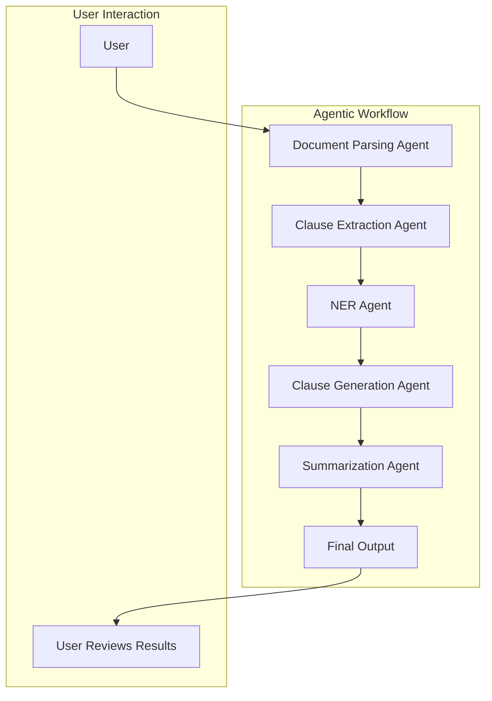
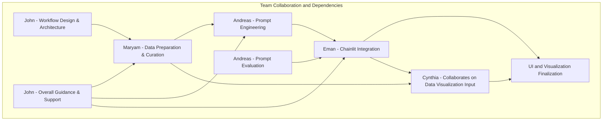

# Hackathon Team Guide

## 📋 Project Overview

We are building a **Contract Lifecycle Management System** leveraging **DeepSeek AI** for advanced contract analysis. The project will focus on automating key processes such as clause extraction, named entity recognition (NER), clause generation, and summarization. The goal is to create a functional MVP (Minimum Viable Product) that showcases the practical application of AI in contract management using an agentic workflow.

### Key Features:

- **Clause Extraction**: Identify and extract key contract clauses.
- **Named Entity Recognition (NER)**: Detect entities like dates, amounts, and legal references.
- **Clause Generation**: Suggest alternative or safer clause language.
- **Summarization**: Generate summaries of contracts for faster review.

## 🛠️ Tools & Technologies

- **Chainlit**: For building the user interface and managing agentic workflows.
- **DeepSeek**: For AI-powered contract analysis.
- **Agno**: Agentic framework.
- **Mermaid.js**: For creating diagrams.

---

## 🧑‍🤝‍🧑 Team Roles & Responsibilities

### John (Team Lead)

- **Role**: Workflow Designer & Facilitator
- **Responsibilities**:
  - Design the agentic workflow and system architecture.
  - Set up the initial infrastructure for agents.
  - Provide technical guidance to all team members.
  - Support prompt engineering and UI integration as needed.

### Maryam

- **Role**: Data Preparation & Curation Lead
- **Responsibilities**:
  - Collect and prepare sample contracts.
  - Clean and structure data for input into DeepSeek.
  - Coordinate with Cynthia to ensure output data is ready for visualization.
  - Support Chainlit output design.

### Andreas

- **Role**: Core Prompt Engineer
- **Responsibilities**:
  - Design and refine prompts for clause extraction, NER, clause generation, and summarization.
  - Collaborate with Maryam on prompt evaluation.
  - Continuously optimize prompts for better performance.

### Eman

- **Role**: Chainlit Integration Lead & UI Developer
- **Responsibilities**:
  - Lead the development of the Chainlit app.
  - Integrate agent outputs into the user interface.
  - Test agents in Chainlit and ensure smooth workflow.
  - Support data curation.

### Cynthia

- **Role**: Data Visualization & UI Specialist
- **Responsibilities**:
  - Build visualizations for agent outputs.
  - Develop data dashboards in Chainlit.
  - Collaborate with Maryam on input and output data format.
  - Ensure the UI is user-friendly and aligns with project goals.

---

## 🌐 Agentic Workflow Overview

We have designed a multi-agent system with the following core agents:

1. **Document Parsing Agent**
2. **Clause Extraction Agent**
3. **NER Agent (Named Entity Recognition)**
4. **Clause Generation Agent**
5. **Summarization Agent**

### Workflow Diagram

---

## 🧩 Team Collaboration Diagram

---

## 🚀 Development Process & Best Practices

1. **Agile Mindset**: Work in small, iterative steps.
2. **Clear Communication**: Use GitHub issues and comments to stay in sync.
3. **Testing & Validation**: Regularly test each agent’s functionality.
4. **Code Reviews**: Ensure code quality and maintainability.

---

## 📅 Timeline & Availability

Please ensure you’re aligned with the team regarding availability.

---

## 📈 Important Notes

- Collaboration is key. Regular check-ins and updates will help keep everyone aligned.
- Keep the focus on simplicity and practicality—prioritize completing a working MVP.

---
