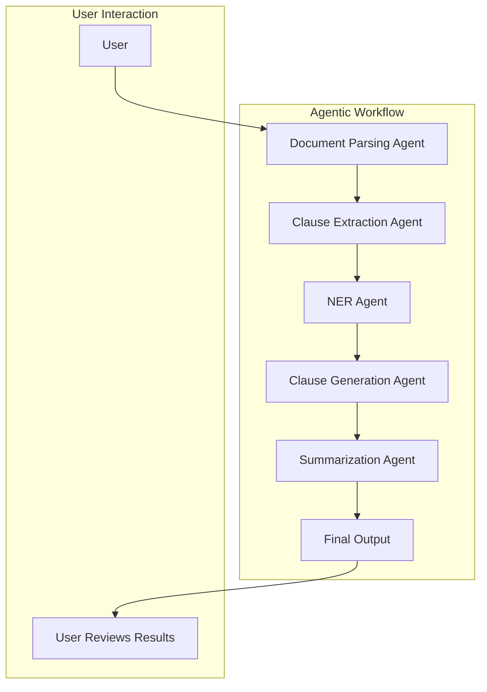
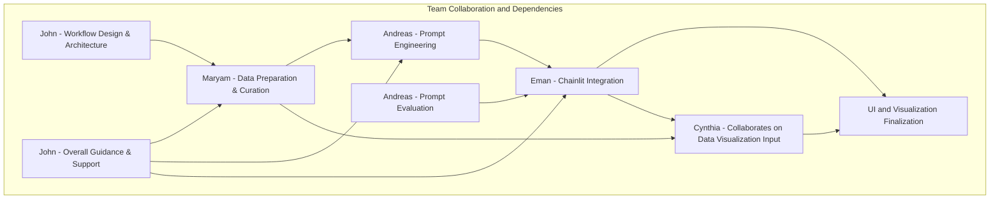

# Hackathon Team Guide

## 📋 Project Overview

We are building a **Contract Lifecycle Management System** leveraging **DeepSeek AI** for advanced contract analysis. The project will focus on automating key processes such as clause extraction, named entity recognition (NER), clause generation, and summarization. The goal is to create a functional MVP (Minimum Viable Product) that showcases the practical application of AI in contract management using an agentic workflow.

### Key Features:

- **Clause Extraction**: Identify and extract key contract clauses.
- **Named Entity Recognition (NER)**: Detect entities like dates, amounts, and legal references.
- **Clause Generation**: Suggest alternative or safer clause language.
- **Summarization**: Generate summaries of contracts for faster review.

## 🛠️ Tools & Technologies

- **Agno**: Agentic framework.
- **Chainlit**: For building the user interface and managing agentic workflows.
- **DeepSeek**: For AI-powered contract analysis.

---

## 🧑‍🤝‍🧑 Team Roles & Responsibilities

### 🧑‍💻 John – Workflow Designer & Team Lead

**Core Tasks:**

- Design and implement the agentic workflow and system architecture.
- Set up the initial infrastructure for agents (Chainlit and DeepSeek integration).
- Provide technical guidance to all team members.
- Ensure smooth collaboration across all roles and maintain overall project direction.
- Support prompt engineering and UI integration when needed.

**Collaboration:**

- Work closely with Maryam to guide data preparation strategies.
- Assist Eman in Chainlit setup and workflow integration.
- Ensure alignment between Andreas' prompt outputs and Cynthia's visualizations.

**Suggested Tools:**

- Chainlit, DeepSeek, Python, Mermaid.js for documentation, GitHub for version control.

---

### 🧑‍💻 Maryam – Data Preparation & Curation Lead

**Core Tasks:**

- Collect sample contracts (target: 20–30 contracts) and extract text using reliable PDF libraries.
- Clean and structure extracted text for input into DeepSeek.
  - Remove irrelevant content (e.g., scanned signatures, headers/footers).
  - Handle OCR and text formatting issues.
  - Organize extracted clauses into structured data (JSON).
- Work closely with Andreas to ensure data is ready for prompt engineering.
- Collaborate with Cynthia to define input/output format for visualizations.

**Collaboration:**

- Coordinate with John for data preparation guidance.
- Share cleaned and structured data with Andreas for prompt design and testing.

**Suggested Tools:**

- `PyPDF2`, pdfmin`er, `Textract`for PDF parsing;`pandas` for data structuring; Python for data cleaning.

---

### 🧑‍💻 Andreas – Core Prompt Engineer

**Core Tasks:**

- Design, test, and refine prompts for clause extraction, NER, clause generation, and summarization.
- Continuously iterate on prompts based on feedback from Maryam’s data and Chainlit outputs.
- Develop evaluation strategies for prompt outputs (simple validation checks for accuracy).
- Collaborate with Eman to ensure agent outputs are properly integrated in Chainlit.

**Collaboration:**

- Work closely with Maryam for clean and structured input data.
- Share prompt-engineered agents with Eman for Chainlit integration.

**Suggested Tools:**

- **DeepSeek**: Primary tool for executing clause extraction, NER, clause generation, and summarization.
- **OpenAI API or ChatGPT Interface**: For prompt design, testing, and refinement in a flexible environment before applying prompts to DeepSeek.
- **Chainlit**: For validating and testing prompt outputs within the agentic workflow.
- **Optional: OpenAI API (Auxiliary Validation)**: Used as an additional step for cross-checking and validating results manually.

---

### 🧑‍💻 Eman – Chainlit Integration Lead & UI Developer

**Core Tasks:**

- Lead the development of the Chainlit app to manage user interaction and agent workflows.
- Integrate agent outputs (e.g., clause extraction, summarization) into a user-friendly interface.
- Test and debug agents within Chainlit.
- Collaborate with Cynthia on data visualization integration.

**Collaboration:**

- Coordinate with John for Chainlit setup and architecture.
- Work closely with Andreas to test prompt outputs within the Chainlit app.
- Collaborate with Cynthia to display visualizations in Chainlit.

**Suggested Tools:**

- `Chainlit`, `Python`, `HTML/CSS` for UI customization.

---

### 🧑‍💻 Cynthia – Data Visualization & UI Specialist

**Core Tasks:**

- Create visualizations for agent outputs (e.g., clause distribution, NER heatmaps, summarization highlights).
- Build data dashboards in Chainlit to present results.
- Ensure the UI is intuitive and visually consistent with project goals.
- Collaborate with Maryam on input/output data format for visualization.

**Collaboration:**

- Work closely with Eman for integrating visualizations into the Chainlit UI.
- Coordinate with Maryam to ensure data is ready for visualization.

**Suggested Tools:**

- `Plotly`, `Altair`, `Matplotlib`, `Seaborn for visualizations; Chainlit for integration; Python for data manipulation.

---

## 🌐 Agentic Workflow Overview

We have designed a multi-agent system with the following core agents:

1. **Document Parsing Agent**
2. **Clause Extraction Agent**
3. **NER Agent (Named Entity Recognition)**
4. **Clause Generation Agent**
5. **Summarization Agent**

### Workflow Diagram

---

## 🧩 Team Collaboration Diagram

---

## 🚀 Development Process & Best Practices

1. **Agile Mindset**: Work in small, iterative steps.
2. **Clear Communication**: Use GitHub issues and comments to stay in sync.
3. **Testing & Validation**: Regularly test each agent’s functionality.
4. **Code Reviews**: Ensure code quality and maintainability.

---

## 📅 Timeline & Availability

Please ensure you’re aligned with the team regarding availability.

---

## 📈 Important Notes

- Collaboration is key. Regular check-ins and updates will help keep everyone aligned.
- Keep the focus on simplicity and practicality—prioritize completing a working MVP.

---
