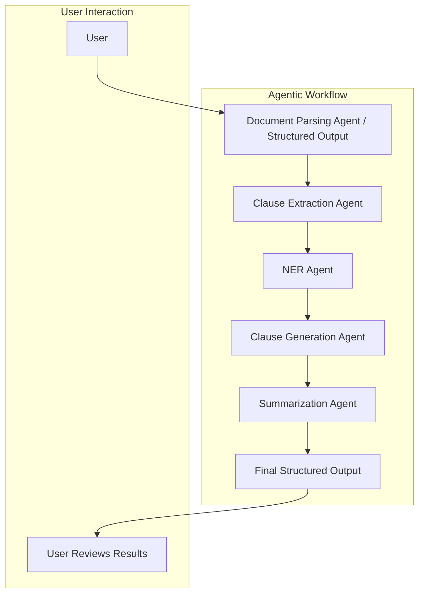

# Contract Lifecycle Management System  
**Hackathon 2025: Fall in love with Deepseek**  

<p align="center">
  
</p>   

<p align="center">
  👉 <strong><a href="https://deepseek-smart-contract-analyzer.streamlit.app/">Try this out</a></strong>
</p>

---

## **Contract Lifecycle Management System**  

Leveraging **DeepSeek AI** for advanced contract analysis, this project automates key processes such as clause extraction, named entity recognition (NER), clause generation, and summarization. The goal is to create a functional MVP (Minimum Viable Product) that showcases AI's practical application in contract management using an agentic workflow.  

### **Key Features:**  

- **Clause Extraction**: Identify and extract key contract clauses.  
- **Named Entity Recognition (NER)**: Detect entities like dates, amounts, and legal references.  
- **Clause Generation**: Suggest alternative or safer clause language.  
- **Summarization**: Generate summaries of contracts for faster review.  

---

## 🛠️ **Tools & Technologies**  

- **Agno**: Agentic framework.  
- **Streamlit**: For building the user interface and managing agentic workflows.  
- **DeepSeek**: For AI-powered contract analysis.  

---

## 🌐 **Agentic Workflow Overview**  

We have designed a multi-agent system with the following core agents:  

1. **Document Parsing Agent**  
2. **Clause Extraction Agent**  
3. **NER Agent (Named Entity Recognition)**  
4. **Clause Generation Agent**  
5. **Summarization Agent**  

### **Workflow Diagram**  




---
## Getting Started

### What You'll Need

1. Python 3.12+ 
2.  Api Key (DeepSeek)

```sh
python --version
```

2. Install uv (if not installed)

```sh
pipx install uv
```

3. Set up virtual environment

```sh
uv venv .venv
source .venv/bin/activate  # On macOS/Linux
.venv\Scripts\activate     # On Windows
```

4. Install dependencies

```sh
uv sync
```

## Running the Project

1. Set up your environment variables:

```sh
DEEPSEEK_API_KEY=your_api_key_here # Temporary not in use
OPENAI_API_KEY=your_api_key_here  # Please keep in mind that this is temporary and will be removed in the future.
```

2. Run the project:

```sh
python app.py
```
# Ideas for Improvement

* Support multiple languages.
* Add a classification agent for more dynamic structured outputs.
* Expand the system to support integrations with contract management platforms.

---
  
